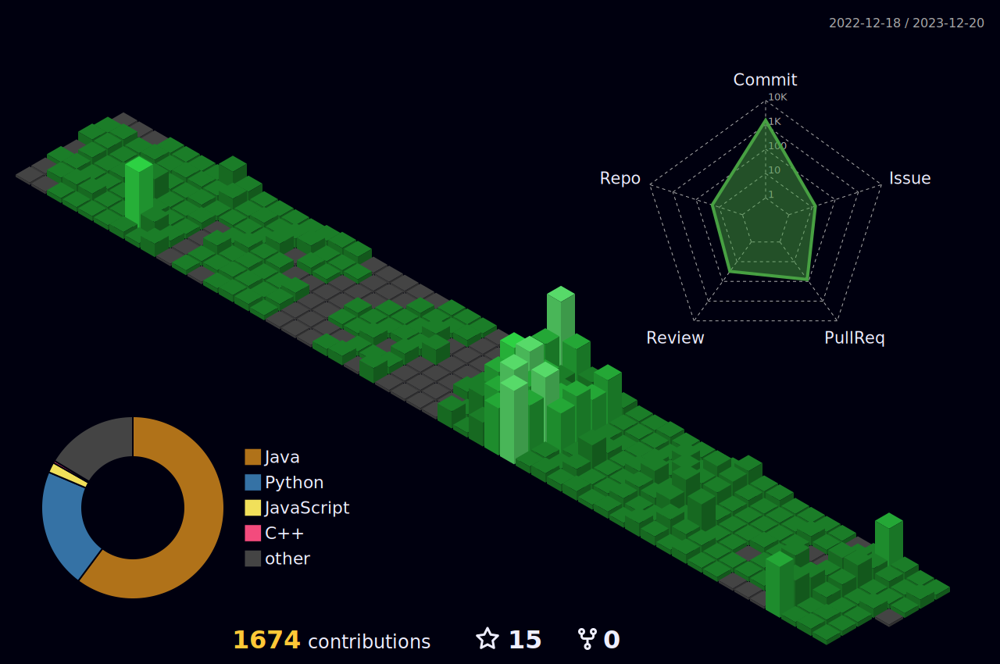

	

 
<pre >
<h3>☑️ Faster Implementation, Faster Adaptation</h3>
  
--- Collaborative Works ---

<li>신촌연합 IT 창업 동아리 <a href="https://github.com/CEOS-Developers">CEOS</a> • 17기 BE (2023.03 ~ 2023.08)</li>
<li>홍익대학교 창업경진대회 최우수상(1위) • Repick (2023.05.26)</li>
<li>중고 의류 거래 플랫폼 <a href="https://github.com/Repick-official/repick-server/tree/develop">Repick</a> • BE (2023.07 ~ )</li>
<li>신촌연합 IT 창업 동아리 <a href="https://github.com/CEOS-Developers">CEOS</a> • 18기 BE 운영진 (2023.08 ~ )</li>

<li>BRAVE & SEOUL IMPACT 2023 창업캠프 대상(1위) • Repick (2023.08.27)</li>
  
--- Personal Works ---
  
<li>소켓, 스레딩을 이용한 Reliable UDP 프로토콜 <a href="https://github.com/mushroom1324/RDTP">RDTP </a>(2023.05 ~ 2023.06)</li>
<li>중고 의류 거래 플랫폼 Repick - <a href="https://github.com/mushroom1324/repick-slack-bot">관리비서 피키</a> 슬랙 봇 (2023.07 ~ )</li>

</pre>

<h2>🛠 Stack</h3>

 

 

<h2>🔗 Status</h3>

  

 

 

  

